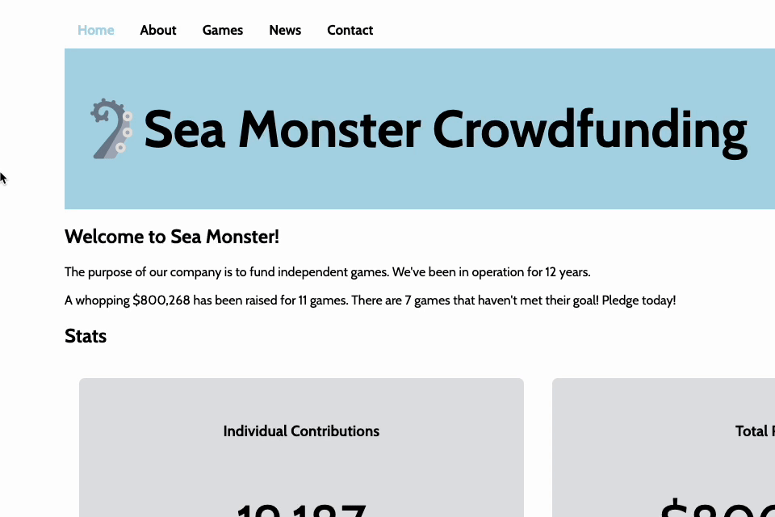

# WEB102 Prework - Sea Monster Crowdfunding App

Submitted by: **Sierra Obi**

**Sea Monster Crowdfunding** is a website for the company Sea Monster Crowdfunding that displays information about the games they have funded.

Time spent: **10.5** hours spent in total

## Required Features

The following **required** functionality is completed:

* [x] The introduction section explains the background of the company and how many games remain unfunded.
* [x] The Stats section includes information about the total contributions and dollars raised as well as the top two most funded games.
* [x] The Our Games section initially displays all games funded by Sea Monster Crowdfunding
* [x] The Our Games section has three buttons that allow the user to display only unfunded games, only funded games, or all games.

The following **optional** features are implemented:

* [x] Added a navbar to the top of the page
* [x] Added a link in the navbar that allows the user to jump down to the "Our Games" section
* [x] Change the background color to lighten the overall look of the site
* [x] Add styling to buttons to signal to the user what selection they have made
* [x] Increased margins around the body to give the webpage a sleeker look
* [x] Change the header font and icon size to percentages to maintain visual aesthetic when the window is resized
* [x] Increased the font size of the header text that displays the name of the website
* [x] Increased the icon size to emphasize the brand
* [x] Removed hover styling for the game cards to reduce confusion by making sure the user doesn't think they can click the game cards
* [x] Add animation to the button hover

## Video Walkthrough

Here's a walkthrough of implemented features:
[Link](https://i.imgur.com/GikogWO.gif)

### Full Demo

### Added Navbar and Changed CSS Styling for Header

### Added Link to Games in Navbar, CSS Styling for Buttons, and Removed Hover from Games

<!-- Replace this with whatever GIF tool you used! -->
GIF created with [Kap](https://getkap.co/) for macOS 
<!-- Recommended tools:
[ScreenToGif](https://www.screentogif.com/) for Windows
[peek](https://github.com/phw/peek) for Linux. -->

## Notes
Thank you for your time and consideration in viewing my submission. I had so much fun doing this project that I almost got carried away when I was experimenting with the customizations, although I tried to keep the integrity of the original design. I can't wait to learn more about making full-stack applications, leveraging different technologies, and diving deeper into design! There is so much I still don't know how to do.

Building this application required patience and focus to complete each challenge. When I encountered an issue, it was often because I didn't have a good understanding of the task. However, by reading the source materials and filling in any gaps with additional reading materials, I was able to complete each challenge. I had the most trouble understanding how the console log output works. Only after reading and trying to find my answer online did I reach out to the WEB102 Slack channel. After Anuj helped explain what I was doing wrong, I felt confident enough to move along. 

## License

    Copyright 2024 Sierra Obi

    Licensed under the Apache License, Version 2.0 (the "License");
    you may not use this file except in compliance with the License.
    You may obtain a copy of the License at

        http://www.apache.org/licenses/LICENSE-2.0

    Unless required by applicable law or agreed to in writing, software
    distributed under the License is distributed on an "AS IS" BASIS,
    WITHOUT WARRANTIES OR CONDITIONS OF ANY KIND, either express or implied.
    See the License for the specific language governing permissions and
    limitations under the License.
